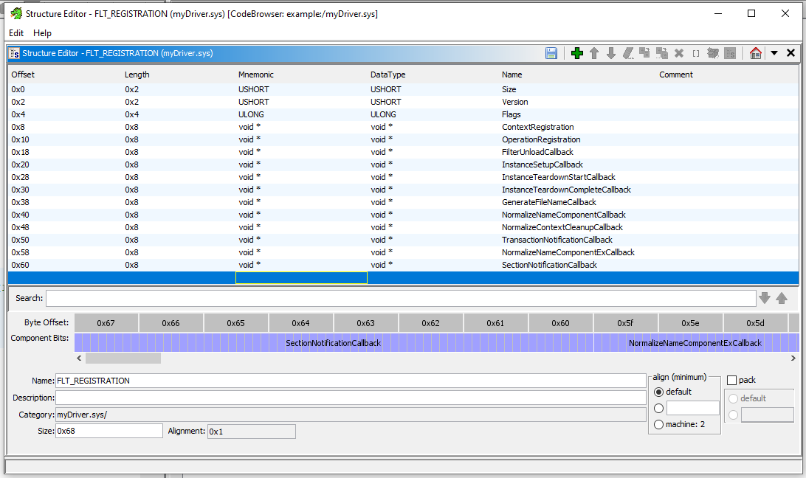

# Intended Solve
## Description
**Do Drivers of Torture Count?**

Impressed by your work so far, Mr. Krabs has come to you with another question.  He thinks some of the files in his system aren't showing up anymore when he clicks thorugh his folders.

Was there anything Plankton did to the system that could have hidden files?

## Starting

By the fact that the challenge has the word "driver" in it and the only other executable in the implant zip file was a driver, you are supposed to gather that you are meant to reverse the driver.

When reversing Windows drivers in Ghidra, a great resource is the following:

https://github.com/0x6d696368/ghidra-data/blob/master/typeinfo/ntddk_64.gdt

This is a Ghidra data type archive for Windows SDK.  It allows Ghidra to identify many functions and makes reversing MUCH easier in general.

## Step 1: Driver Entry
THe first thing to do when statically reversing a driver is to find driver entry.

Looking through the outgoing function calls from the entry point in Ghidra, you can see the following outgoing call graph for one of the functions.

<p float="left">
    
    
</p>

One of the functions calls FltRegisterFilter, FltUnregisterFilter, and FltStartFiltering.  This is a dead giveaway for a filter driver Driver Entry function, so we label it and move into it.

Alternatively, of the two functions called in entrypoint, one just handles entry failure, and the other calls this function:


This function calls another function (`FUN1400019c8`) if there's a 0 passed to it and handles errors otherwise.  The function it calls when successful is the driver entry (the "main" function for the driver).

When we open driver entry, it looks like this:


The first function (`FUN_140001b40`) in DriverEntry is a kernel networking function that connects to a remote IP.  Reversing it is an interesting exercise to go through, but reversing the networking does not help recover the flag for this challenge, so I'm not going to go into the process of reversing it in detail.  Anyone familiar with C reversing and the Windows Kernel API should have been able to go through that with no problem.

The next two functions, called through a system thread with `KeInitializeMutex` and `PsCreateSystemThread`, use the socket connection to send the word `HELLO`, then function as an echo server.  Again, this was just to give people something to look at and doesn't factor in to the solution, so I'm not going to go into it.

As a note to anyone who tried dynamic analysis first - the driver will not start unless it can successfully establish a TCP socket with the remote IP.  As you can tell from the binary, this is just a standard TCP socket with no authentication, so setting up a machine on your test network with an IP of `192.168.187.13` and starting a netcat listener on port `8080` would have allowed the driver to start.


## Final DriverEntry Function
Next, since most of the functions here are well documented in the Microsft API documentation, it should be simple enough to look up their signatures and relabel them.  Once you do that, as well as correctly renaming the networking functions, DriverEntry looks like this:


There is only one more unlabled function. Clicking into it, we can see it is generating a bunch of gloabl unicode strings that contain seemingly random data.


There's no way of knowing what these are yet, so we label the function and come back to it later.

Finally, Driver Entry is fully labeled and clean to look at.


## Next Steps

Where do we go from here?

This is a Windows Filter Driver (or more specifically, a minifilter driver) as can be figured out by the calls to the Windows Filtering API (`FltRegisterFiler`, `FltStartFiltering`, etc.). The fact that it is a minifilter driver can be determined by the fact that it doesn't handle all possible file operations, which legacy filter drivers have to do. 

Before attempting to reverse the driver, you should make yourself familiar with the functionality of Windows Minifilter Drivers.  [This documentation](https://learn.microsoft.com/en-us/windows-hardware/drivers/ifs/filter-manager-concepts) from Microsoft should give you enough information to figure out what is going on. 

## FltRegisterFilter

For minifilter drivers, the [`FltRegisterFilter`](https://learn.microsoft.com/en-us/windows-hardware/drivers/ddi/fltkernel/nf-fltkernel-fltregisterfilter) function accepts a structure of the type [`FLT_REGISTRATION`](https://learn.microsoft.com/en-us/windows-hardware/drivers/ddi/fltkernel/ns-fltkernel-_flt_registration) that contains a lot of information about the functionality of the driver, and particularly the callbacks it has registered.  

Unfortunately, the `ntddk.gdt` file does not contain a predefined `FLT_REGISTRATION` structure.  However, the Microsoft documentation has a full definition of it, so it is possible to make one in Ghidra.

The definition of the structure in the Microsoft definition looks like this:


And the recreation I made in Ghidra looks like this:



Applying this to the data, we can see the following:


All callbacks for the minifilter driver are registered through the OperationRegistration pointer, which points to an array of [`FLT_OPERATION_REGISTRATION`](https://learn.microsoft.com/en-us/windows-hardware/drivers/ddi/fltkernel/ns-fltkernel-_flt_operation_registration) structures, each of which registers a callback for a certain kind of I/O operation.

Again, this data type is not in `ntddk.gdt`, but it is well defined in the Microsoft API documentation.

Before making the `FLT_OPERATION_REGISTRATION`, for ease of visibility, I created an enum with all of the Major function codes. The list of them is provided by Windows Internals [here](https://github.com/LordNoteworthy/windows-internals/blob/master/IRP%20Major%20Functions%20List.md).

The Ghidra enum looked as follows:


Then, just like before, retrieving the callback registrations is simply a matter of making a Ghidra struct that mirrors the Microsoft documentation.

Microsoft documentation:


And here is the Ghidra representation.  Note that the `UCHAR` given for the `MajorFunction` field actually ends up allocated with 4 bytes for alignment purposes, despite theoretically only requiring one.


Applying this to the data at the OperationRegistration function location gets us the following.


## Next Steps

There are two filter major function callback registrations in the structure, a PreOperation for `IRP_MJ_CREATE` and a PostOperation for `IRP_MJ_DIRECTORY_CONRTOL`.  `IRP_MJ_CREATE` actually functions as "obtain handle to resource, and if it doesn't exist make it" in Windows, and `IRP_MJ_DIRECTORY_CONTROL` handles, somewhat obviously, directory control operations.

If you think about the wording of the challenge, Mr. Krabs can't see certain files in his directories.  This lends itself to being implemented through the Directory Control operations.  Since that is where the flag is, that is the only function I am going to reverse here.  If you did not pick up the hint in the challenge wording though and reversed both functions, you would see that the PreCreate callback for the `IRP_MJ_CREATE` function blocks any attempts by the user to get a handle to the "MoneyGrabber.exe" executable.


## PostDirectoryControl
The methodology for reversing the PostDirectoryControl function is not dissimilar from reversing the eariler parts of the driver, so I'm not going to go through my steps in as much detail.  Look up functions in the Microsoft Documentation, then use the structure definitions from their documented arguments to clean up the data in Ghidra.

Eventually, if you do everything correctly and retype your variables well, you notice that the upper part of the function is just safely retrieving some data from the directory structure.  The lower part of the function is more interesting however, and will have an output that looks something like this:


As you can see, the function XORs each byte of the current file name with a key that is stored in a global variable (remember the CreateStrings function from earlier?), then checks it against a predefined string in memory.  If it matches, it removes the file from the current directory listing.

Pulling the key and the predefined check string from memory, we can use a Python script to recover the names of the files the driver is checking for and removing.

```python
key = b"\x56\x4f\x79\x70\xe0\xc6\xb0\x59\xc7\xfc\x30\x8b\x89\x56\xbc\x6b\x28\xfe\xd8\xf4"

buffer1 = b"\x03\x02\x38\x23\xb3\xbd\xd6\x68\x8b\xcb\x03\xf9\xd6\x78\xc8\x13\x5c"
buffer2 = b"\x12\x3d\x48\x06\xd3\xb4\xe3\x06\x94\xcc\x6f\xe3\xb9\x61\x92\x1f\x50\x8a"
buffer3 = b"\x09\x3d\x48\x17\xa8\xf1\xef\x37\xf7\xab\x4d\xa5\xfd\x2e\xc8"


def xor(data, key):
    return bytes([data[i] ^ key[i % len(key)] for i in range(len(data))])


print(xor(buffer1, key))
print(xor(buffer2, key))
print(xor(buffer3, key))
```

Gives you the following output:
```
b'UMASS{f1L73r_.txt' 
b'Dr1v3rS_S0_h07.txt'
b'_r1gH7_n0W}.txt'
```

The flag is the following: `UMASS{f1L73r_Dr1v3rS_S0_h07_r1gH7_n0W}`